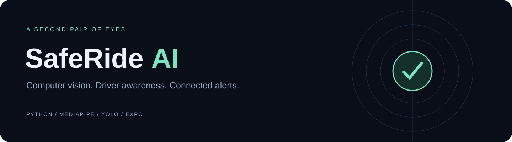
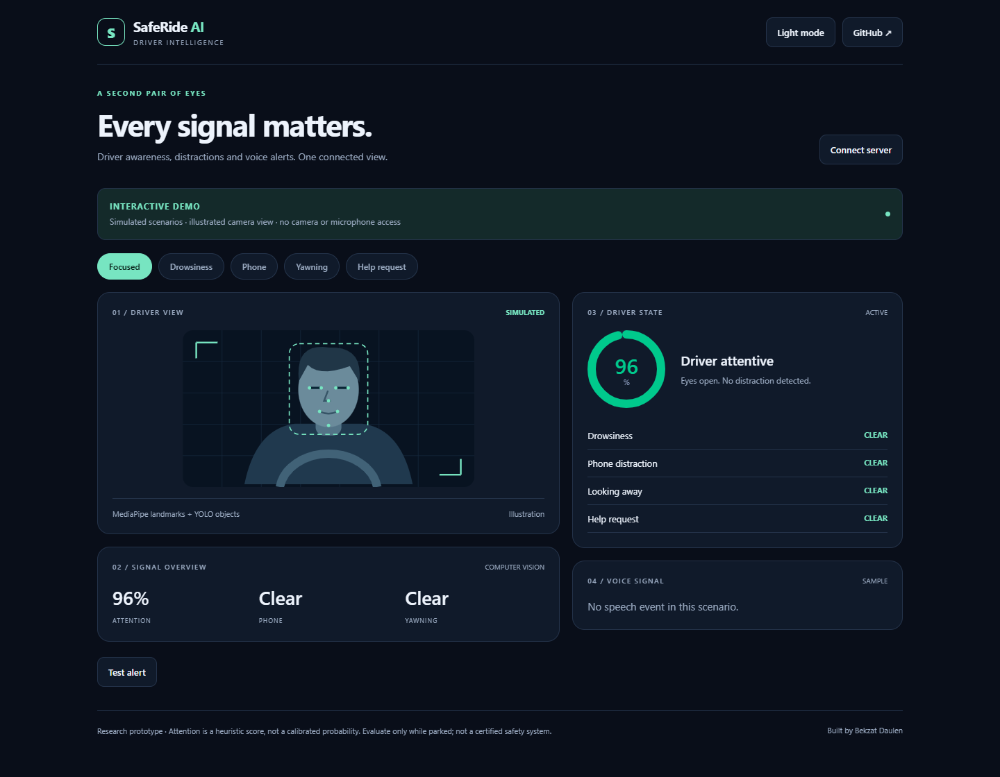
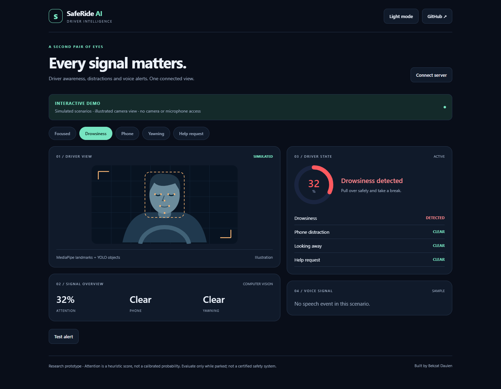
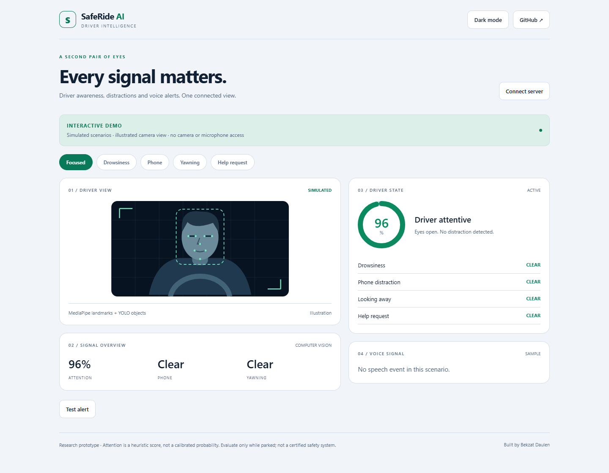
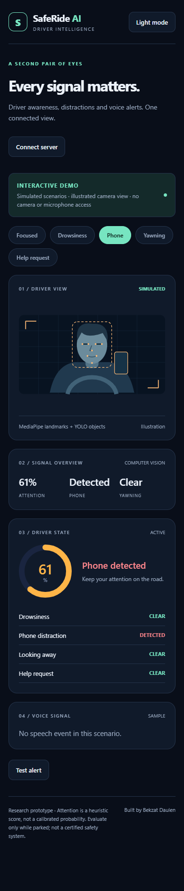
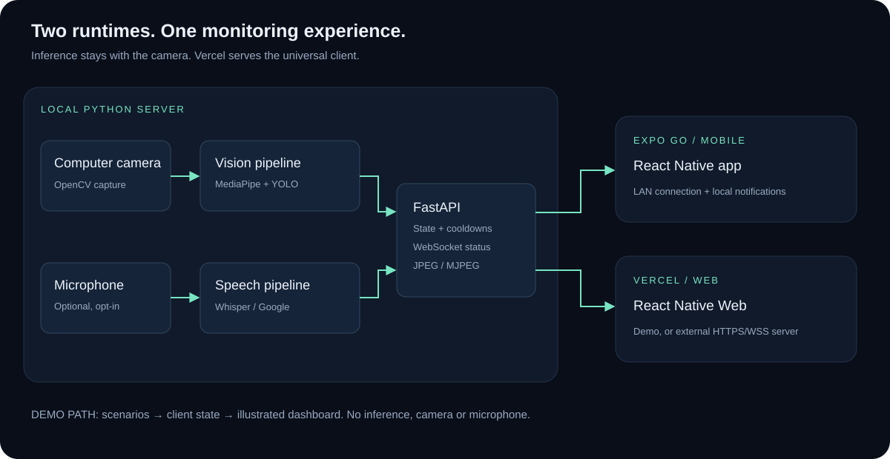
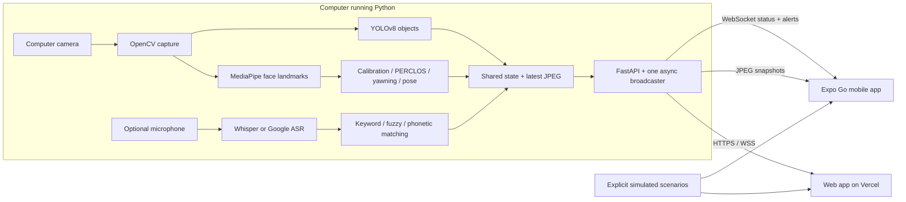

<div align="center">



# SafeRide AI

**A second pair of eyes for driver awareness.**

A computer-vision research prototype that connects a local Python inference server to an Expo mobile app and a responsive web dashboard.

[](https://docs.expo.dev/versions/v57.0.0/)
[](backend/)
[](mobile/)
[](https://github.com/re1nhardd/SafeRideAI/actions/workflows/ci.yml)

[Explore the web demo](https://saferide-ai-re1nhardd.vercel.app) · [Run with Expo Go](#run-on-your-phone-with-expo-go) · [Architecture](#architecture) · [Engineering review](docs/ENGINEERING_REVIEW.md)

</div>

## The idea

SafeRide AI brings visual and voice signals into a single monitoring interface: eye closure, yawning, head orientation, phone presence, and optional help-phrase detection. The Python backend processes frames from the **computer's camera**; the phone displays the results and alerts.

The project uses pretrained MediaPipe and YOLO models with calibrated thresholds and temporal heuristics. It does **not** claim a newly trained foundation model, validated accident prevention, or a measured detection accuracy.

> **Try it without hardware:** the hosted demo opens with explicitly labeled simulated scenarios and an illustrated driver. It never activates your camera or microphone. Choose **Connect server** to switch to real data from your own inference server.

## A look inside

### Desktop dashboard



### Drowsiness scenario



<details>
<summary><strong>Light theme and mobile layout</strong></summary>



<p align="center"></p>

</details>

These are screenshots of the running web application, including its responsive mobile layout. The driver illustration and readings are **demo data**, not inference results or screenshots from a physical phone.

## Capabilities

| Signal | Implementation | Output |
|---|---|---|
| Eye closure | MediaPipe face landmarks, calibrated Eye Aspect Ratio, rolling PERCLOS | Warning / drowsiness states |
| Yawning | Inner-lip opening relative to mouth width, persistence threshold | Yawning indicator |
| Head orientation | Landmark-based `solvePnP` and rotation decomposition | Looking-away indicator |
| Phone / distractions | Pretrained YOLOv8 object detection | Phone presence, annotated boxes |
| Attention | Weighted penalties and exponential smoothing | Heuristic 0–100 score |
| Speech, optional | Whisper or Google recognition, keyword/fuzzy/phonetic matching | Transcript, help / concerning-speech signals |
| Alerts | Per-category cooldowns on the server | In-app messages; native local notifications and haptics where available |
| Connection health | Retry backoff, stale-message timeout, fresh-frame checks | Explicit offline / no-camera / no-face / calibration states |

A phone visible in the image is not proof of active phone use. Head pose, speech keywords and attention thresholds remain experimental heuristics.

## Architecture





**Deployment boundary:** Vercel serves the exported client. Real inference remains on a computer with camera access and a long-running Python process. The current capture architecture is not a remote camera-upload service and does not run ML inside Vercel or on the phone.

The server owns camera/model resources in one worker thread. A single async broadcaster sends status and alerts on the ASGI event loop. Clients receive status twice per second; inference defaults to a target of 5 FPS, with actual throughput depending on hardware. JPEG polling is capped at roughly 4 requests/second per mobile/web client.

## Quick start — browser demo

Requirements: **Node.js 22.13+**, npm, Git. Python is unnecessary for demo mode. SDK version requirements are documented in the [Expo SDK 57 reference](https://docs.expo.dev/versions/v57.0.0/).

```bash
git clone https://github.com/re1nhardd/SafeRideAI.git
cd SafeRideAI/mobile
npm ci
npm run web
```

Open the address printed by Expo. Demo mode is available immediately, without accounts, API keys, or model downloads.

## Run on your phone with Expo Go

### 1. Install a matching Expo Go

This project targets **Expo SDK 57**. Select SDK 57 and your platform on the [official Expo Go download page](https://expo.dev/go). The Expo Go version must match the project's SDK.

For physical iPhones, do not assume that an arbitrary App Store build supports SDK 57: the [SDK 57 release notes](https://expo.dev/changelog/sdk-57) describe installation through `eas go` while store availability is pending. Follow the current iOS installation route on the official download page. If needed, run `npx eas-cli@latest go` and follow its account/device prompts. A development build is the alternative when a compatible Expo Go cannot be installed.

### 2. Start the Expo development server

On your computer, from `mobile/`:

```bash
npm ci
npx expo start --go --lan
```

Keep this terminal open. Connect the phone and computer to the **same Wi-Fi**.

- **Android:** open Expo Go and scan the terminal QR code.
- **iPhone:** scan with the Camera app, then open the link in the compatible Expo Go installation.
- Allow local network access if iOS asks.

The app starts in demo mode. You can explore scenarios without Python or camera permissions.

### 3. Start the real inference server

Install **Python 3.12**. In a second terminal, from the repository root:

**Windows PowerShell**

```powershell
cd backend
py -3.12 -m venv .venv
.\.venv\Scripts\python.exe -m pip install -r requirements.txt
$env:SAFERIDE_HOST = "0.0.0.0"
.\.venv\Scripts\python.exe server.py
```

**macOS / Linux**

```bash
cd backend
python3.12 -m venv .venv
source .venv/bin/activate
python -m pip install -r requirements.txt
SAFERIDE_HOST=0.0.0.0 python server.py
```

Allow camera access on the computer. On first use, MediaPipe's face-landmarker asset and the YOLOv8n weights are downloaded into `backend/models/`; internet is needed for this initial setup. Models are not committed to Git.

Open `http://localhost:8000/health` to inspect readiness, or `http://localhost:8000/dashboard` for the local monitor. Look toward the camera with eyes open during the initial five-second calibration. Vision runs locally after the model files are available.

### 4. Connect the phone

1. Find the computer's LAN IPv4 address: `ipconfig` on Windows, network settings on macOS, or `hostname -I` on Linux.
2. Open **Connect server** in the app.
3. Enter, for example, `192.168.1.10:8000` and press **Connect**.
4. Permit local notifications if requested. Keep the app in the foreground while testing.
5. Confirm **SERVER CONNECTED**, then wait for the camera, models and calibration to become ready.

Use the **computer's LAN address**, not `localhost`: on the phone, `localhost` means the phone itself. The camera source remains the computer; the Expo app does not capture or upload phone-camera frames.

If Windows Firewall prompts, allow the Python server on your trusted private network. Both port **8081** (Expo) and **8000** (Python) need to be reachable from the phone. Do not broadly disable the firewall.

**Expo tunnel note:** `npx expo start --go --tunnel` can help deliver the JavaScript bundle, but it does not tunnel the separate Python backend. For live monitoring, the phone must still reach that backend.

Local notifications are used here, not remote push delivery. Background execution and locked-screen alert delivery are not guaranteed. See [Expo notifications](https://docs.expo.dev/versions/v57.0.0/sdk/notifications/) for platform limitations.

## Optional speech recognition

Audio is **off by default**. Install extras only if you want microphone input:

```bash
python -m pip install -r requirements-audio.txt
```

Choose a backend through environment variables, then restart the Python server:

```powershell
# Windows PowerShell: local Whisper recognition
$env:SAFERIDE_AUDIO = "whisper"
$env:SAFERIDE_LANGUAGE = "en"
.\.venv\Scripts\python.exe server.py
```

```bash
# macOS / Linux
SAFERIDE_AUDIO=whisper SAFERIDE_LANGUAGE=en python server.py
```

Whisper downloads its speech model the first time. For Google recognition, use `SAFERIDE_AUDIO=google` and a locale such as `en-US` or `ru-RU`; this sends audio to Google's recognition service and needs internet. Whisper language codes use `en`, `ru`, etc. `auto` chooses an available backend, but explicit selection makes processing location clear.

PyAudio may require PortAudio development libraries on macOS/Linux. Transcript logging is disabled unless you explicitly set `SAFERIDE_SPEECH_LOG` to a file path. Speech alert flags expire after ten seconds to avoid endless repeats from an old utterance.

## Vercel deployment

The root `vercel.json` defines a static export:

| Setting | Value |
|---|---|
| Root directory | Repository root |
| Install command | `npm ci --prefix mobile` |
| Build command | `npm run build --prefix mobile` |
| Output directory | `mobile/dist` |
| Framework preset | Other |

```bash
npx vercel --prod
```

Alternatively, import this repository in Vercel and keep those settings. The deployment opens in demo mode. For live monitoring from the HTTPS site, connect to a separately hosted **HTTPS/WSS** inference server and include the exact frontend origin in `SAFERIDE_ALLOWED_ORIGINS`.

An HTTPS page cannot use an insecure `http://192.168...` / `ws://...` backend. Use Expo Go or the locally served web app for a LAN-only server. The backend is a trusted-network prototype with no user authentication; do not expose it directly to the public internet. Add an authenticated gateway or private network before remote use.

## Configuration

Set variables in your shell before launching Python; `backend/.env.example` is documentation and is **not automatically loaded**.

| Variable | Default | Purpose |
|---|---|---|
| `SAFERIDE_HOST` | `127.0.0.1` | Use `0.0.0.0` for a trusted LAN |
| `PORT` | `8000` | HTTP / WebSocket port |
| `SAFERIDE_CAMERA` | `0` | OpenCV camera index |
| `SAFERIDE_FPS` | `5` | Target inference rate, clamped to 1–30 |
| `SAFERIDE_AUDIO` | `off` | `off`, `whisper`, `google`, `auto` |
| `SAFERIDE_LANGUAGE` | `en-US` | Use a locale for Google; `en`/`ru` for Whisper |
| `SAFERIDE_ALLOWED_ORIGINS` | localhost / 127.0.0.1 on 8081 and 8000 | Comma-separated browser origins |
| `SAFERIDE_HARDWARE` | `1` | `0` starts the API without camera/models for tests |
| `SAFERIDE_YOLO_MODEL` | `backend/models/yolov8n.pt` | Optional custom weights; absolute path recommended |
| `SAFERIDE_SPEECH_LOG` | unset | Optional transcript log file |

## API

| Endpoint | Purpose |
|---|---|
| `GET /health` | Readiness, camera state, current signals, client count |
| `GET /snapshot` | Latest annotated JPEG; `503` when absent or stale |
| `GET /stream` | MJPEG stream for the local dashboard |
| `GET /dashboard` | Lightweight local monitor |
| `WS /ws` | Status updates and rate-limited alerts |

```json
{
  "type": "status",
  "data": {
    "attention": 84.1,
    "alert": "NONE",
    "camera_ready": true,
    "detector_ready": true,
    "calibrated": true,
    "face_detected": true,
    "phone_detected": false,
    "looking_away": false,
    "yawning": false,
    "speech_text": "",
    "offensive_detected": false,
    "help_detected": false,
    "error": ""
  }
}
```

## Project map

```text
SafeRideAI/
├── mobile/                    # Shared Expo / React Native / web client
│   ├── App.tsx                # Responsive dashboard + labeled demo scenarios
│   ├── src/useServer.ts       # WebSocket lifecycle + native local notifications
│   ├── src/endpoint.ts        # HTTP/HTTPS and WS/WSS address normalization
│   ├── src/Ring.tsx           # Attention indicator
│   └── tests/                 # Address and tooling regression tests
├── backend/
│   ├── server.py              # FastAPI, inference worker, async broadcaster
│   ├── dashboard.html         # Local monitor
│   ├── src/detection_v2.py    # Face geometry, PERCLOS, pose, YOLO
│   ├── src/audio_v2.py        # Optional ASR and keyword matching
│   ├── src/train_model.py     # Optional training with your labeled dataset
│   └── tests/                 # API, lifecycle, cooldown, speech, model smoke tests
├── docs/images/               # Original illustrations and app screenshots
├── docs/ENGINEERING_REVIEW.md # Changes, validation and remaining limitations
├── .github/workflows/ci.yml   # Web build, types and automated tests
└── vercel.json                # Web deployment configuration
```

## Development and verification

```bash
cd mobile
npm ci
npm run typecheck
npm test
npm run build
npx expo-doctor
```

```bash
cd backend
python -m pip install -r requirements-test.txt
python -m pytest -q
```

For real-model smoke tests, also install `requirements.txt` and set `SAFERIDE_TEST_MODELS=1` before running pytest. They exercise a blank synthetic frame and geometry; they do not measure real-world detection accuracy. CI intentionally runs without camera hardware or model downloads.

To fine-tune YOLO, supply a real labeled dataset YAML:

```bash
# From backend/
python -m src.train_model --data /path/to/dataset.yaml --epochs 50 --device cpu
```

No labeled dataset or benchmark results are bundled. The detector expects class names such as `cell phone`, `book`, and `laptop`. Third-party model weights remain subject to their upstream licenses.

## Troubleshooting

| Symptom | What to check |
|---|---|
| Expo Go says incompatible SDK | Install a matching SDK 57 build from the official Expo Go page |
| App opens but cannot reach Python | LAN IP, same Wi-Fi, `SAFERIDE_HOST=0.0.0.0`, firewall, port 8000 |
| Hosted app refuses a local HTTP address | HTTPS requires HTTPS/WSS; use Expo Go or local web for LAN |
| Camera is unavailable | Permissions, another app using it, `SAFERIDE_CAMERA` index |
| Models do not load | First-run network access, writable `backend/models/`, `/health` error |
| Connected but no attention score | Camera, detected face and completed calibration are all required |
| No speech or notifications | Audio is opt-in; check microphone/notification permissions and foreground state |
| Brightness, glasses or camera angle change results | Recalibrate and evaluate under controlled conditions |

## Scope and next steps

This is a research/portfolio prototype, not a certified driver-safety device. Test while parked. Lighting, occlusion, glasses, camera position and speaker context can produce false positives or negatives. Attention is a heuristic score rather than a probability; voice matching cannot establish danger or intent.

Useful future work: a consented labeled evaluation dataset, measured precision/recall and latency, camera-source abstraction, authenticated remote access, and physical-device testing across Android/iOS.

Built by **Bekzat Daulen** · [GitHub](https://github.com/re1nhardd)
